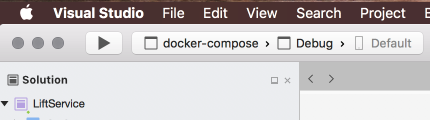
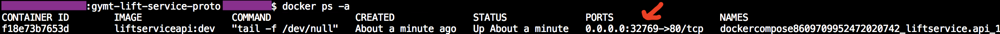
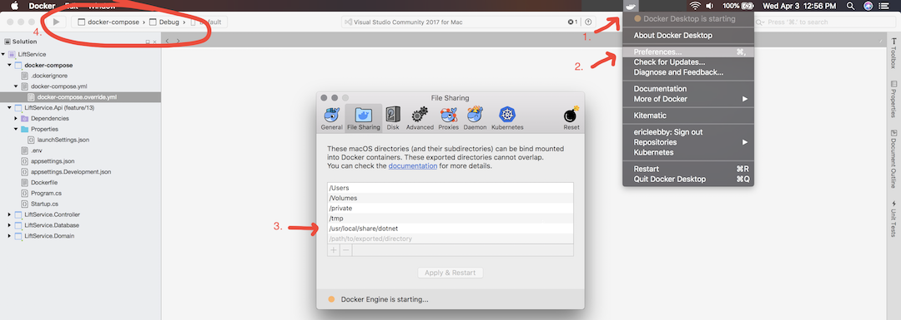

# Gymt Api

## Dev Requirements

TODO: update dotNet SDK link below with correct url for version 2.1

1. You will need the [dotNet SDK](https://download.visualstudio.microsoft.com/download/pr/a4b4e61e-0905-4eb8-9d2c-9f5f390312e7/e1edac05922be70b51007739ed0db49e/dotnet-sdk-2.2.105-osx-gs-x64.pkg). This project is currently built on dotNet Core 2.1.
2. Docker
    * You will need Docker for Windows, Docker for Mac, or the corresponding Docker daemon installed on your system.
	* Docker should be in `linux` container mode. This is an option even on Docker for Windows.

## To Run

### IDE

Visual Studio will automatically detect that the solution is set up to run via Container Orchestration. When the solution is open, the F5 (or Ctrl + F5) Debug action should be set to "docker-compose".



If a browser is not automatically launched, navigate to `<docker ip>:<docker port>/swagger` to interact with the API. As far as your application knows, it is listening on port 80. To find the port that is being exposed on your host for this container, run

```
docker ps -a
```

You will be able to see the container port exposed to your host.



In this example, the url to test your api is `localhost:32771/swagger`.


### CLI

To run via CLI, open the project root in a terminal. Then use the following command:

```
docker-compose up
```

Docker Compose caches your built image, so if you have previously started the service application by CLI (which you will oft do during development) you may need to use:

```
docker-compose up --build
```

Navigate to `<docker ip>:<docker port>/swagger` to interact with the API.

Stop the containers with:

```
docker-compose down
```

### Troubleshooting on OSX

#### Sharing Nuget cache on OSX
You may encounter an error while trying to run directly from your IDE on OSX. Visual Studio for Mac somehow wraps the Docker dotnet runtime in its own debugger-attached runtime. Somewhere in this process, it needs access to the local Nuget package cache folder. This is a matter of sharing the folder via Docker for Mac. This is resolved by sharing the following directory: `/usr/local/share/dotnet`

See the below screenshot for help doing this.


